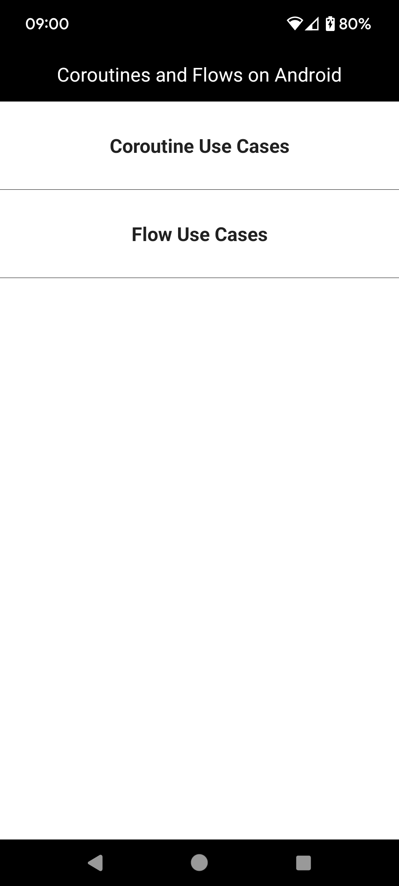
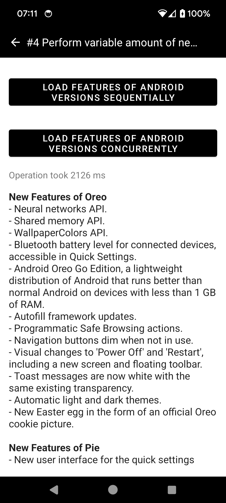
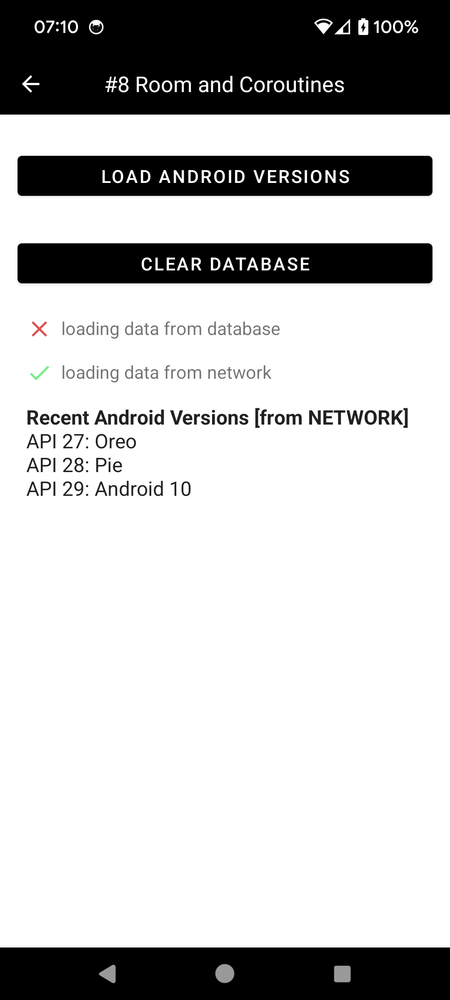

# Coroutines And Flows On Android

This is Udemy [Kotlin Coroutines and Flow for Android Development (2024)](https://www.udemy.com/course/coroutines-on-android/)  training.

 

## Getting Started

Download the project from [Github](https://github.com/Maniak-pl/CoroutinesAndFlowsOnAndroid), the updated branch is **master**

### Dependencies

This project uses the following dependencies

- [Kotlin Coroutines](https://developer.android.com/kotlin/coroutines)
- [Kotlin Flow](https://developer.android.com/kotlin/flow)
- [Retrofit](https://square.github.io/retrofit/)
- [Gson](https://github.com/google/gson)
- [RxAndroid](https://github.com/ReactiveX/RxAndroid)
- [Room](https://developer.android.com/jetpack/androidx/releases/room)

## Screenshots

  

## License

Licensed under the Apache License, Version 2.0 (the "License").
You may obtain a copy of the License at

   http://www.apache.org/licenses/LICENSE-2.0

Unless required by applicable law or agreed to in writing, software
distributed under the License is distributed on an "AS IS" BASIS,
WITHOUT WARRANTIES OR CONDITIONS OF ANY KIND, either express or implied.
See the License for the specific language governing permissions and
limitations under the License.

You agree that all contributions to this repository, in the form of fixes, pull-requests, new examples etc. follow the above-mentioned license.
